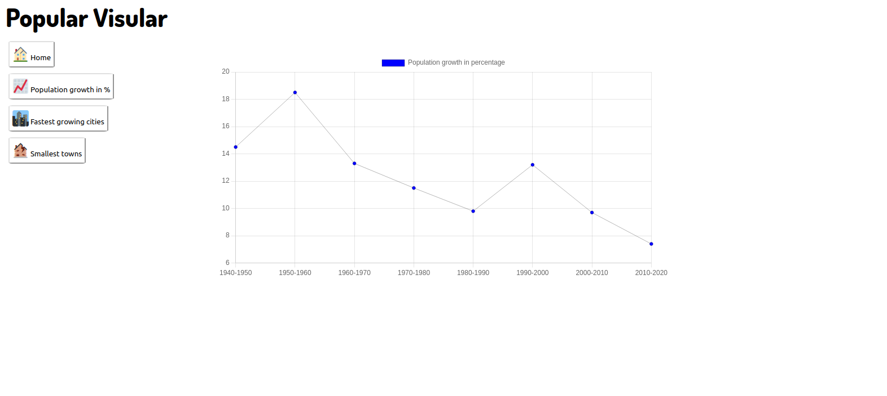

# PopuliVisular:

Data science application showcasing population data inside the USA


## Current data being displayed:

- Growth data in the span of 50 years
- Fastest growing cities in the USA
- Least populated towns in the USA


### Data sources:

[Growth data in percentage]
https://www.brookings.edu/research/census-2020-data-release/

[Fastest growing cities in the USA]
https://www.census.gov/library/stories/2020/05/america-a-nation-of-small-towns.html

[Smallest towns in the USA] 
https://www.mentalfloss.com/article/502234/smallest-town-each-50-states





### Future app goals:

- [ ] Adding more sources for information
- [ ] New option demographic percentage in the span of 50 years to a century
- [ ] Add video/gif walkthrough of app use
- [ ] Adding all information to a backend API instead of having all data inserted into inline JS code

#### How to use:


1. Clone repo into desired directory ```git clone https://github.com/Toughee/PopuliVisular.git``` or ```gh repo clone Toughee/PopuliVisular```
2. Run ```npm install``` in your terminal to install all app node modules and dependencies
3. Run ```yarn start``` in your terminal to run app on http://localhost:3000/